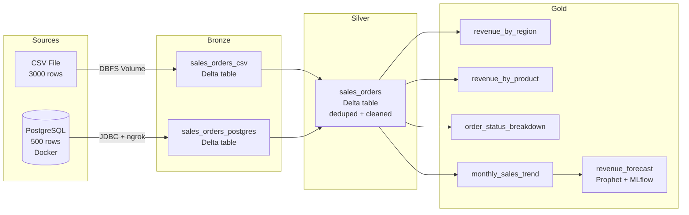

# Medallion Architecture — Databricks + Delta Lake + MLflow

A production-grade data engineering portfolio project implementing the
**Bronze → Silver → Gold Medallion Architecture** with a ML forecasting
capstone, shared transformation package, local runnable path, and CI pipeline.

Themed around **Kali BMH Systems** — a B2B bulk material handling manufacturer
with sales data across six Indian states.

---

## Architecture



---

## Key features

- **Medallion Architecture** — Bronze raw ingestion → Silver cleaned and trusted → Gold business aggregations
- **Hybrid ingestion** — CSV via Databricks Volume + PostgreSQL via JDBC over ngrok TCP tunnel
- **Idempotent Silver pipeline** — Window function deduplication (Postgres = master source) + `MERGE INTO` upserts
- **Shared transformation package** — `src/medallion/` imported by both Databricks notebooks and local runner — no code drift
- **Local runnable path** — full pipeline runs on any laptop with `python run_local.py`, no cloud account needed
- **ML forecasting capstone** — Prophet time-series model forecasts 6 months of revenue, tracked with MLflow
- **Data quality enforcement** — Delta table constraints reject invalid Gold data at write time
- **Tested and CI** — pytest suite with session-scoped Spark fixture + GitHub Actions green checkmark

---

## Run paths

### Local (any laptop — no cloud account needed)

```bash
# Clone and install
git clone https://github.com/SudharshanSanjay/medallion-architecture-databricks
cd medallion-architecture-databricks
pip install setuptools pyspark==3.5.3 delta-spark==3.2.0
pip install pandas prophet scikit-learn mlflow matplotlib pytest

# Generate data
python src/data_generator.py --rows 3000

# Run full pipeline
python run_local.py
```

Delta tables write to `./lakehouse/`, MLflow runs to `./mlruns/`,
forecast chart to `docs/images/revenue_forecast.png`.

### Databricks (cloud path)

1. Create a free Databricks account at [community.cloud.databricks.com](https://community.cloud.databricks.com)
2. Run `notebooks/00_setup.py` to create the `kali_demo` Unity Catalog
3. Upload `data/raw/sales_orders_csv.csv` to `/Volumes/kali_demo/bronze/raw_files/`
4. Start a local PostgreSQL container: `docker compose up -d`
5. Expose it via ngrok: `ngrok tcp 5432` — note the forwarding URL
6. Run notebooks `01` → `02` → `03` → `04` in order

---

## Results

### Revenue by region (Gold)

| Region | Total Revenue | Orders | Avg Order Value |
|---|---|---|---|
| Tamil Nadu | ₹1.73 Cr | 99 | ₹1.75L |
| Rajasthan | ₹1.61 Cr | 89 | ₹1.81L |
| Maharashtra | ₹1.59 Cr | 78 | ₹2.04L |
| Gujarat | ₹1.57 Cr | 84 | ₹1.87L |
| Telangana | ₹1.41 Cr | 74 | ₹1.91L |
| Karnataka | ₹1.39 Cr | 76 | ₹1.83L |

### Revenue at risk
**188 orders** in PENDING/CONFIRMED state — **₹3.63 Crore** not yet guaranteed.

### Forecast
Prophet model forecasts revenue growing from ₹7 Crore (May 2026)
to ₹13 Crore (Sep 2026) — consistent with the 60% YoY growth trend
in the dataset.

---

## Project structure
## Project structure

```
medallion-architecture-databricks/
├── notebooks/                  # Databricks notebooks (cloud path)
│   ├── 00_setup.py
│   ├── 01_bronze_ingest.py
│   ├── 02_silver_transform.py
│   ├── 03_gold_aggregate.py
│   └── 04_gold_forecast.py
├── src/
│   ├── data_generator.py       # Faker-based data generator with trend + seasonality
│   └── medallion/              # Shared transformation package
│       ├── config.py           # ENV switch, paths, catalog names
│       ├── schema.py           # Explicit StructType definitions
│       ├── bronze.py           # Ingestion functions
│       ├── silver.py           # Dedup + clean pipeline
│       ├── gold.py             # 4 aggregation functions
│       └── forecast.py         # Prophet + MLflow forecasting
├── tests/                      # pytest suite
│   ├── conftest.py             # Session-scoped Spark fixture
│   ├── test_silver.py          # Dedup + cleaning correctness
│   └── test_gold.py            # Aggregation math correctness
├── docs/
│   ├── architecture.md         # Deep technical narrative
│   └── IMPROVEMENT_PLAN.md     # Project improvement roadmap
├── sql/
│   └── seed_postgres.sql       # PostgreSQL seed script (500 rows)
├── .env.example                # Credential template
├── .github/workflows/ci.yml    # GitHub Actions CI
├── docker-compose.yml          # PostgreSQL container
├── requirements.txt            # Pinned dependencies
└── run_local.py                # One-command local pipeline runner
```

---

## Tech stack

| Layer | Technology |
|---|---|
| Compute | Databricks Serverless / PySpark 3.5.3 local |
| Storage | Delta Lake 3.2.0 |
| Governance | Unity Catalog |
| Ingestion | JDBC + ngrok TCP tunnel |
| Forecasting | Prophet 1.1.6 |
| Experiment tracking | MLflow 3.13.0 |
| Testing | pytest + GitHub Actions CI |
| Infrastructure | Docker, Homebrew, Python venv |

---

## Author

**Sudharshan Sanjay** — [sudharshansanjay.de](https://sudharshansanjay.de)